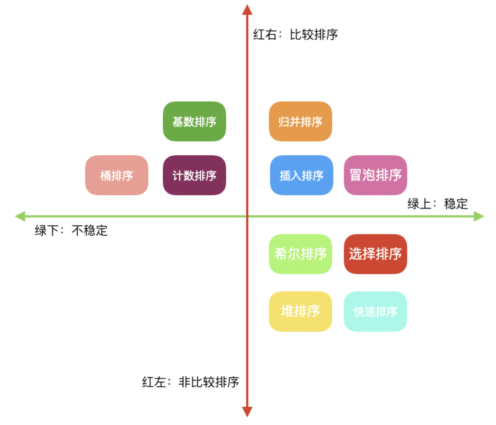

# 经典排序算法

#### 实现环境

* Qt Creator 5.14.2, Plain C++ Application, qmake
* C++ 11
* MacBook Pro

#### 分类

* **比较类排序**:通过比较来决定元素间的相对次序,由于其时间复杂度不能突破O(nlogn),因此也称为非线性时间比较类排序. 分为以下4种类型:
  	
  	+ **交换排序**:(1)冒泡排序 (2)快速排序
  	
  	+ **插入排序**:(1)插入排序 (2)希尔排序
  	
  	+ **选择排序**:(1)选择排序 (2)堆排序
  	
  	+ **归并排序**:(1)二路归并排序 (2)多路归并排序

* **非比较排序**:不通过比较来决定fqgxuj的相对次序,它可以突破基于比较排序的时间下界,以线性时间运行,因此了称为线性时间非比较类排序.
  * 计数排序 
  * 桶排序 
  * 基数排序

#### 相关概念

* **稳定排序**:未排序前a在b前面,且a==b,排序后a仍然在b前面. 
* **不稳定排序**:未排序前a在b前面,且a==b,排序后a可能会在b的后面. 
* **原地排序**:排序过程中不申请额外的存储空间,只利用原来待排序数据的存储空间进行比较和交换数据排序. 
* **时间复杂度**(**Time** **Complexity**)：描述运行算法所花费的时间量的计算复杂度，记做O(f(n))（记为大O表示法）。n称为问题的规模，当n不断变化时,时间频度会跟随n规律性变化变化，用T(n)表示。若有某个辅助函数f(n),使得当n趋近于无穷大时，T(n)/f(n)的极限值为不等于零的常数，则称f(n)是T(n)的同数量级函数。记作T(n)=Ｏ(f(n)),称Ｏ(f(n)) 为算法的渐进时间复杂度，简称时间复杂度。
* **空间复杂度**(**Space** **Complexity**)：空间复杂度是对一个算法在运行过程中临时占用存储空间大小的量度。

#### 算法复杂度比较

| 排序方法 | 时间复杂度(平均)         | 最坏        | 最好        | 空间复杂度  | 稳定性 |
| -------- | ------------------------ | ----------- | ----------- | ----------- | ------ |
| 冒泡排序 | O(n^2^)   ==n==:数据规模 | O(n^2^)     | O(n)        | O(1)        | 稳定   |
| 快速排序 | O(nlog~2~n)              | O(n^2^)     | O(nlog~2~n) | O(nlog~2~n) | 不稳定 |
| 插入排序 | O(n^2^)                  | O(n^2^)     | O(n)        | O(1)        | 稳定   |
| 希尔排序 | O(n^1.3^)                | O(n^2^)     | O(n)        | O(1)        | 不稳定 |
| 选择排序 | O(n^2^)                  | O(n^2^)     | O(n^2^)     | O(1)        | 不稳定 |
| 堆排序   | O(nlog~2~n)              | O(nlog~2~n) | O(nlog~2~n) | O(1)        | 不稳定 |
| 归并排序 | O(nlog~2~n)              | O(nlog~2~n) | O(nlog~2~n) | O(n)        | 稳定   |
|          |                          |             |             |             |        |
| 计数排序 | O(n+k) ==k==:桶的个数    | O(n+k)      | O(n+k)      | O(n+k)      | 稳定   |
| 桶排序   | O(n+k)                   | O(n^2^)     | O(n)        | O(n+k)      | 稳定   |
| 基数排序 | O(n*k)                   | O(n*k)      | O(n*k)      | O(n+k)      | 稳定   |



#### 1. 冒泡排序

----

**冒泡排序**（Bubble Sort），是一种计算机科学领域的较简单的排序算法。它重复地走访过要排序的元素列，依次比较两个相邻的元素，一层一层的将较大的元素往后移动，其现象和气泡在上升过程中慢慢变大类似，故成为冒泡排序。

**算法思想**
（1）从第一个和第二个开始比较，如果第一个比第二个大，则交换位置，然后比较第二个和第三个，逐渐往后
（2）经过第一轮后最大的元素已经排在最后，所以重复上述操作的话第二大的则会排在倒数第二的位置。
（3）那重复上述操作n-1次即可完成排序，因为最后一次只有一个元素所以不需要比较。

**算法分析**
	冒泡排序是一种简单直接暴力的排序算法，为什么说它暴力？因为每一轮比较可能多个元素移动位置，而元素位置的互换是需要消耗资源的，所以这是一种偏慢的排序算法，仅适用于对于含有较少元素的数列进行排序。

​	`稳定性`：从代码中可以看出只有前一个元素大于后一个元素才可能交换位置，所以相同元素的相对顺序不可能改变，所以它是稳定排序
​	`比较性`：因为排序时元素之间需要比较，所以是比较排序
​	`时间复杂度`：因为它需要双层循环n*(n-1))，所以平均时间复杂度为O(n^2)
​	`空间复杂度`：只需要常数个辅助单元，所以空间复杂度为O(1)，把空间复杂度为O(1)也即是原地排序（in-place）

```C++
#include <iostream>
#include <vector>
using namespace std;
void PrintVec(vector<int> vec)
{
    cout << "当前序列: ";
    for(auto it = vec.begin();it != vec.end(); it++)
        cout << *it  << " ";
    cout << endl;
}
void PrintArray(int *arr,int len)
{
    cout << "当前序列: ";
    for(int i = 0; i < len ; i++)
        cout << *(arr+i)  << " ";
    cout << endl;
}
void BubbleSortByVector(vector<int>& vec)
{
    cout << "************冒泡排序非优化版本>>待排序元素个数:" << vec.size() << endl;
    PrintVec(vec);
    for(size_t i = 0; i < vec.size() -1; i++) //总共需要循环vec.size()-1趟
    {
        cout << "第" << i+1 << "趟:" << endl;
        for(size_t j = 0; j < vec.size() -1; j++) //每一趟需要比较的次数也为vec.size()-1次
        {
            cout << "..第" << j+1 << "个元素比较: ";
            if(vec[j] > vec[j+1])//这不是优版本,因为遇到1,2,3,4已有序的情况,仍然是O(n^2).
            {
                cout << vec[j] << " > " << vec[j+1] << ",交换" <<  endl;
                swap(vec[j],vec[j+1]);
            }
            else
            {
                cout << vec[j] << " <= " << vec[j+1] << ",不交换" <<  endl;
            }
            PrintVec(vec);
        }
    }
}
void BubbleSortByVector2(vector<int>& vec)
{
    cout << "***********冒泡排序优化V1>>待排序元素个数:" << vec.size() << endl;
    PrintVec(vec);
    for(size_t i = 0; i < vec.size() -1; i++) //总共需要循环vec.size()-1趟
    {
        bool bSwap = false; //本趟是否发生交换,如果未发生交换, 说明序列已有序
        cout << "第" << i+1 << "趟:" << endl;
        for(size_t j = 0; (j < vec.size() -1); j++) //每一趟需要比较的次数也为vec.size()-1次
        {
            cout << "..第" << j+1 << "个元素比较: ";
            if(vec[j] > vec[j+1])
            {
                cout << vec[j] << " > " << vec[j+1] << ",交换" <<  endl;
                swap(vec[j],vec[j+1]);
                bSwap = true;
            }
            else
            {
                cout << vec[j] << " <= " << vec[j+1] << ",不交换" <<  endl;
            }
            PrintVec(vec);
        }
        if(!bSwap)
        {
            cout << "本趟未发生交换,序列已经有序" << endl;
            break;//该趟未发生交换,已有序, 终止比较
        }
    }
}

void BubbleSortByVector3(vector<int>& vec)
{
    cout << "***********冒泡排序优化V2>>待排序元素个数:" << vec.size() << endl;
    PrintVec(vec);
    bool bSwap = true; //本趟是否发生交换,如果未发生交换, 说明序列已有序,初始是乱序的, 需要遍历交换
    for(size_t i = 0; i < vec.size() -1 && bSwap; i++) //总共需要循环vec.size()-1趟
    {
        bSwap = false; //假定第趟扫描完成,没有发生交换,序列已有序
        cout << "第" << i+1 << "趟:" << endl;
        for(size_t j = 0; (j < vec.size() -1); j++) //每一趟需要比较的次数也为vec.size()-1次
        {
            cout << "..第" << j+1 << "个元素比较: ";
            if(vec[j] > vec[j+1])
            {
                cout << vec[j] << " > " << vec[j+1] << ",交换" <<  endl;
                swap(vec[j],vec[j+1]);
                bSwap = true;
            }
            else
            {
                cout << vec[j] << " <= " << vec[j+1] << ",不交换" <<  endl;
            }
            PrintVec(vec);
        }
    }
}
//待排序数组arr,元素个数为len
void BubbleSort(int *arr,int len)
{
    cout << "**********C语言版本冒泡排序>>从后冒泡,元素个数: " << len << endl;
    PrintArray(arr,len);
    int i = 0, j = 0,tmp = 0;
    bool bSwap = true;
    for(i = 0; i < len-1 && bSwap; i++)
    {
        bSwap = false;
        cout << "第" << i+1 << "趟:" << endl;
        for(j = len - 1; j > 0; j--)
        {
            cout << "..第" << j+1 << "个元素比较: ";
            if(arr[j] < arr[j-1])
            {
                cout << arr[j] << " < " << arr[j-1] << ",交换" <<  endl;
                tmp = arr[j];
                arr[j] = arr[j-1];
                arr[j-1] = tmp;
                bSwap = true;
            }
            else
            {
                cout << arr[j] << " >= " << arr[j-1] << ",不交换" <<  endl;
            }
            PrintArray(arr,len);
        }
    }
}
int main()
{
    vector<int> VecData = {1,2,3,4};
    BubbleSortByVector(VecData);

    VecData.clear();
    VecData = {9,1,2,3};
    BubbleSortByVector2(VecData);

    VecData.clear();
    VecData = {9,1,2,3};
    BubbleSortByVector3(VecData);

    VecData.clear();
    VecData = {1,2,3,4};
    BubbleSortByVector2(VecData);

    VecData.clear();
    VecData = {1,2,3,4};
    BubbleSortByVector3(VecData);

    int arr[4] = {94,22,531,4};
    BubbleSort(arr,4);
    int arr1[4] = {2,3,9,4};
    BubbleSort(arr1,4);
    int arr2[4] = {1,2,3,4};
    BubbleSort(arr2,4);
    return 0;
}
//运行结果
//************冒泡排序非优化版本>>待排序元素个数:4
//当前序列: 1 2 3 4 
//第1趟:
//..第1个元素比较: 1 <= 2,不交换
//当前序列: 1 2 3 4 
//..第2个元素比较: 2 <= 3,不交换
//当前序列: 1 2 3 4 
//..第3个元素比较: 3 <= 4,不交换
//当前序列: 1 2 3 4 
//第2趟:
//..第1个元素比较: 1 <= 2,不交换
//当前序列: 1 2 3 4 
//..第2个元素比较: 2 <= 3,不交换
//当前序列: 1 2 3 4 
//..第3个元素比较: 3 <= 4,不交换
//当前序列: 1 2 3 4 
//第3趟:
//..第1个元素比较: 1 <= 2,不交换
//当前序列: 1 2 3 4 
//..第2个元素比较: 2 <= 3,不交换
//当前序列: 1 2 3 4 
//..第3个元素比较: 3 <= 4,不交换
//当前序列: 1 2 3 4 
//***********冒泡排序优化V1>>待排序元素个数:4
//当前序列: 9 1 2 3 
//第1趟:
//..第1个元素比较: 9 > 1,交换
//当前序列: 1 9 2 3 
//..第2个元素比较: 9 > 2,交换
//当前序列: 1 2 9 3 
//..第3个元素比较: 9 > 3,交换
//当前序列: 1 2 3 9 
//第2趟:
//..第1个元素比较: 1 <= 2,不交换
//当前序列: 1 2 3 9 
//..第2个元素比较: 2 <= 3,不交换
//当前序列: 1 2 3 9 
//..第3个元素比较: 3 <= 9,不交换
//当前序列: 1 2 3 9 
//本趟未发生交换,序列已经有序
//***********冒泡排序优化V2>>待排序元素个数:4
//当前序列: 9 1 2 3 
//第1趟:
//..第1个元素比较: 9 > 1,交换
//当前序列: 1 9 2 3 
//..第2个元素比较: 9 > 2,交换
//当前序列: 1 2 9 3 
//..第3个元素比较: 9 > 3,交换
//当前序列: 1 2 3 9 
//第2趟:
//..第1个元素比较: 1 <= 2,不交换
//当前序列: 1 2 3 9 
//..第2个元素比较: 2 <= 3,不交换
//当前序列: 1 2 3 9 
//..第3个元素比较: 3 <= 9,不交换
//当前序列: 1 2 3 9 
//***********冒泡排序优化V1>>待排序元素个数:4
//当前序列: 1 2 3 4 
//第1趟:
//..第1个元素比较: 1 <= 2,不交换
//当前序列: 1 2 3 4 
//..第2个元素比较: 2 <= 3,不交换
//当前序列: 1 2 3 4 
//..第3个元素比较: 3 <= 4,不交换
//当前序列: 1 2 3 4 
//本趟未发生交换,序列已经有序
//***********冒泡排序优化V2>>待排序元素个数:4
//当前序列: 1 2 3 4 
//第1趟:
//..第1个元素比较: 1 <= 2,不交换
//当前序列: 1 2 3 4 
//..第2个元素比较: 2 <= 3,不交换
//当前序列: 1 2 3 4 
//..第3个元素比较: 3 <= 4,不交换
//当前序列: 1 2 3 4 
//**********C语言版本冒泡排序>>从后冒泡,元素个数: 4
//当前序列: 94 22 531 4 
//第1趟:
//..第4个元素比较: 4 < 531,交换
//当前序列: 94 22 4 531 
//..第3个元素比较: 4 < 22,交换
//当前序列: 94 4 22 531 
//..第2个元素比较: 4 < 94,交换
//当前序列: 4 94 22 531 
//第2趟:
//..第4个元素比较: 531 >= 22,不交换
//当前序列: 4 94 22 531 
//..第3个元素比较: 22 < 94,交换
//当前序列: 4 22 94 531 
//..第2个元素比较: 22 >= 4,不交换
//当前序列: 4 22 94 531 
//第3趟:
//..第4个元素比较: 531 >= 94,不交换
//当前序列: 4 22 94 531 
//..第3个元素比较: 94 >= 22,不交换
//当前序列: 4 22 94 531 
//..第2个元素比较: 22 >= 4,不交换
//当前序列: 4 22 94 531 
//**********C语言版本冒泡排序>>从后冒泡,元素个数: 4
//当前序列: 2 3 9 4 
//第1趟:
//..第4个元素比较: 4 < 9,交换
//当前序列: 2 3 4 9 
//..第3个元素比较: 4 >= 3,不交换
//当前序列: 2 3 4 9 
//..第2个元素比较: 3 >= 2,不交换
//当前序列: 2 3 4 9 
//第2趟:
//..第4个元素比较: 9 >= 4,不交换
//当前序列: 2 3 4 9 
//..第3个元素比较: 4 >= 3,不交换
//当前序列: 2 3 4 9 
//..第2个元素比较: 3 >= 2,不交换
//当前序列: 2 3 4 9 
//**********C语言版本冒泡排序>>从后冒泡,元素个数: 4
//当前序列: 1 2 3 4 
//第1趟:
//..第4个元素比较: 4 >= 3,不交换
//当前序列: 1 2 3 4 
//..第3个元素比较: 3 >= 2,不交换
//当前序列: 1 2 3 4 
//..第2个元素比较: 2 >= 1,不交换
//当前序列: 1 2 3 4 
```


